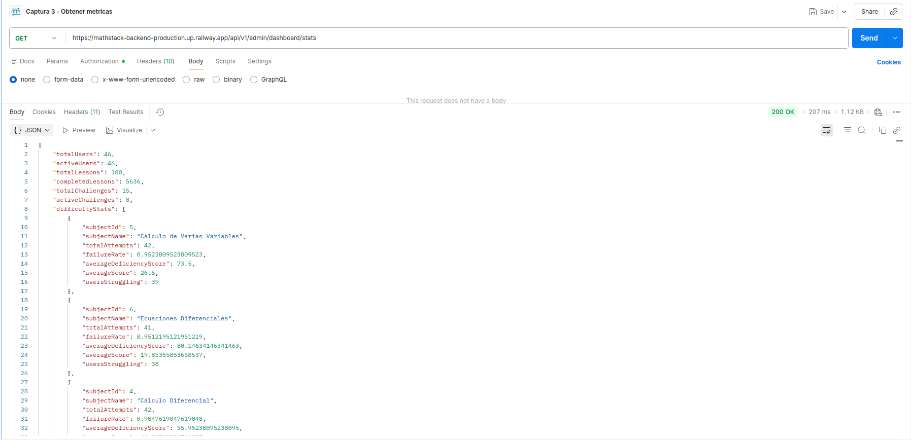
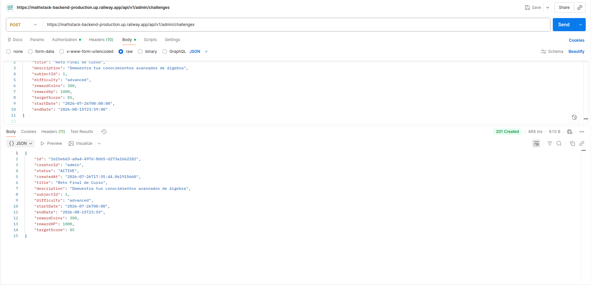

# MathStack - Panel de Administrador

Aplicación orientada a profesores para la gestión de la plataforma **MathStack**. Desde aquí se monitorean métricas y se configuran entidades globales como Retos Competitivos.

Esta aplicación es una SPA construida en React + Vite que interactúa exclusivamente con los endpoints del `MathStack-Backend`.

---

## Arquitectura

El panel sigue una estructura de componentes organizados por vistas completas (Dashboard, Gestión de Usuarios, Configuración de Retos).
La arquitectura impone una fuerte delegación de responsabilidades:
- **UI State**: Controla modales, menús y alertas mediante hooks nativos (`useState`).
- **Data Fetching**: Archivos como `api/apiClient.ts` o `services/challengeService.ts` asumen el control de las promesas de red. La UI queda agnóstica a *cómo* se recupera la información de la base de datos PostgreSQL.

---

## Variables de Entorno

Al igual que la aplicación cliente, es posible definir la ruta del servidor utilizando el archivo `.env.local`:

```env
VITE_API_BASE_URL=http://localhost:8080/api/v1
```

---

## Instrucciones de Instalación y Ejecución

Asegúrate de contar con Node.js y dependencias actualizadas.

1. Navega al directorio: `cd 'MathStack-Panel Administrador'`
2. Instala los paquetes: `npm install`
3. Arranca el servidor local: `npm run dev`
4. Abre en tu navegador el dashboard (usualmente `http://localhost:5174`).
5. Para generar archivos compilados listos para despliegue: `npm run build`

---

## Endpoints Administrativos y Seguridad

Al ser un panel de gestión, el control de acceso y el manejo de errores es primordial.
- Si una API devuelve un error `401 Unauthorized` o `403 Forbidden`, la interfaz reacciona desconectando la sesión o mostrando una pantalla de rechazo de permisos.
- **Endpoints Clave:**
  - `GET /api/v1/admin/dashboard`: Obtiene la consolidación masiva de datos (Métricas DTOs).
  - `POST /api/v1//challenges`: Permite al admin subir un nuevo reto configurando su materia, recompensas (XP/Coins) y fechas.

---

##  Pruebas y Evidencia
Dashboard:

---
Retos:

---

## Declaración de Uso de IA y Recursos Externos

**Inteligencia Artificial:** Herramientas LLM (Gemini/ChatGPT) fueron utilizadas para la creación de componentes analíticos y de métricas (Charts), para establecer el boilerplate de la comunicación asíncrona (Fetch) y para resolver desafíos de CSS responsivo con Tailwind. Todas las funcionalidades base de datos de administración y roles fueron implementadas y dirigidas conscientemente por los desarrolladores humanos, quienes validaron el código generado por IA.
**Recursos Adicionales:** React, Vite, Tailwind CSS, Lucide React (iconografía administrativa), Recharts (para las gráficas del dashboard).
